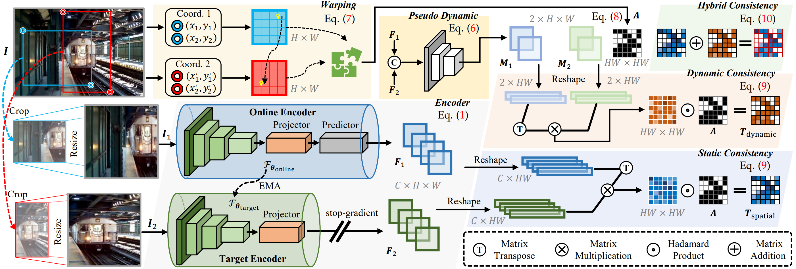

#  HVC (Dynamic in Static: Hybrid Visual Correspondence for Self-Supervised Video Object Segmentation)
>This repository is the official PyTorch implementation of the paper "**Dynamic in Static: Hybrid Visual Correspondence for Self-Supervised Video Object Segmentation**"

## Abstract
>Conventional video object segmentation (VOS) methods usually necessitate a substantial volume of pixel-level annotated video data for fully supervised learning. In this paper, we present HVC, a **h**ybrid spatial-temporal **v**isual **c**orrespondence framework for self-supervised VOS setting. HVC extracts pseudo-dynamic signals from static images to achieve an economical and scalable VOS model. Our approach utilizes a minimalist fully-convolutional architecture to capture spatial-temporal visual correspondence in image-cropped views. To achieve this objective, we present a unified self-supervised approach to learn representations of spatial-temporal feature similarity. Firstly, we establish spatial correspondence by utilizing a priori coordinate information between cropped views to guide the formation of consistent spatial feature representations. Subsequently, we devise a concise convolutional layer to capture the forward / backward pseudo-dynamic flows between two views, serving as a cue for temporal representations. Finally, we propose a hybrid visual correspondence loss to learn joint spatial and temporal consistency representations. Our approach, without bells and whistles, necessitates only one training session from static image data, minimizing memory consumption (**16GB**) and training time (**2h**). Moreover, HVC achieves state-of-the-art performance in several self-supervised VOS benchmarks.

><center>The architeture of HVC.</center>

## Highlights
- **Performance:** HVC achieves SOTA self-supervised results on video object segmentation, part propagation, and pose tracking.  
**video object segmentation** (J&F Mean):  
DAVIS16 val-set: **80.1**  
DAVIS17 val-set: **73.1**  
DAVIS17 dev-set: **61.7**  
YouTube-VOS 2018 val-set: **71.9**  
YouTube-VOS 2019 val-set: **71.6**  
**part propagation** (mIoU):  
VIP val-set: **44.6**  
**pose tracking** (PCK):  
JHMDB val-set: **61.7** PCK@0.1; **82.8** PCK@0.2
- **Efficiency:** HVC necessitates only one training session from static image data (COCO), minimizing memory consumption (∼**16GB**) and training time (∼**2h**).
- **Robustness**: HVC enables the same self-supervised VOS performance with static image datasets ([COCO](https://cocodataset.org/): **73.1**, [PASCAL VOC](http://host.robots.ox.ac.uk/pascal/VOC/): **72.0**, and [MSRA10k](https://mmcheng.net/msra10k/): **71.1**) as with the video dataset (e.g. [YouTube-VOS](https://youtube-vos.org/dataset/vos/): **73.1**).

## Requirements
- python 3.9
- torch==1.12.1 
- torchvision==0.13.1
- CUDA 11.3

Create a conda envvironment:
```bash
conda create -n hvc python=3.9 -y
conda activate hvc
pip install torch==1.12.1+cu113 torchvision==0.13.1+cu113 --extra-index-url https://download.pytorch.org/whl/cu113
```

## Model Zoo and Results
| Model                           | J&F Mean ↑   |  Download                |
| :-----------------------------: | :----------: | :----------------------: |
| HVC pre-trained on COCO         |  DAVIS17 val-set: 73.1  |  [model](https://github.com/PGSmall/HVC/releases/download/v0.1/releases_models.zip) / [results](https://github.com/PGSmall/HVC/releases/download/v0.1/hvc_coco.zip) |
| HVC pre-trained on PASCAL VOC   |  DAVIS17 val-set: 72.0  |  [model](https://github.com/PGSmall/HVC/releases/download/v0.1/releases_models.zip) / [results](https://github.com/PGSmall/HVC/releases/download/v0.1/hvc_voc.zip) |
| HVC pre-trained on MSRA10k      |  DAVIS17 val-set: 71.1  |  [model](https://github.com/PGSmall/HVC/releases/download/v0.1/releases_models.zip) / [results](https://github.com/PGSmall/HVC/releases/download/v0.1/hvc_msra.zip) |
| HVC pre-trained on YouTube-VOS  |  DAVIS17 val-set: 73.1  |  [model](https://github.com/PGSmall/HVC/releases/download/v0.1/releases_models.zip) / [results](https://github.com/PGSmall/HVC/releases/download/v0.1/hvc_ytb.zip) |

``Note:`` HVC requires only one training session to infer all test datasets for VOS. 

## Dataset Preparation
For the static image dataset:
1. Donwload the COCO 2017 train-set from the [COCO website](https://cocodataset.org/).
2. Please ensure the datasets are organized as following format.
```
data
  |--filelists
  |--Static
    |--JPEGImages
      |--COCO
      |--MSRA10K
      |--PASCAL
```
For the video dataset:
1. Download the DAVIS 2017 val-set from the [DAVIS website](https://davischallenge.org/), the direct download [link](https://data.vision.ee.ethz.ch/csergi/share/davis/DAVIS-2017-trainval-480p.zip).
2. Download the full YouTube-VOS dataset (version 2018) from the [YouTube-VOS website](https://youtube-vos.org/dataset/vos/), the direct download [link](https://drive.google.com/drive/folders/1bI5J1H3mxsIGo7Kp-pPZU8i6rnykOw7f?usp=sharing). Please move ``ytvos.csv`` from ``data/`` to the path ``data/YTB/2018/train_all_frames``.
3. Please ensure the datasets are organized as following format.
```
data
  |--filelists
  |--DAVIS
      |--Annotations
      |--ImageSets
      |--JPEGImages
  |--YTB
      |--2018
           |--train_all_frames
                   |--ytvos.csv
           |--valid_all_frames
```
``Note:`` Please prepare the following datasets if you want to test the DAVIS dev-set and YouTube-VOS val-set (2019 version).

Download link: [DAVIS dev-set](https://data.vision.ee.ethz.ch/csergi/share/davis/DAVIS-2017-test-dev-480p.zip), [YTB 2019 val-set](https://drive.google.com/drive/folders/1BWzrCWyPEmBEKm0lOHe5KLuBuQxUSwqz?usp=sharing).

## Training
```bash
# pre-train on COCO
bash ./scripts/run_train_img.sh
```
Or
```bash
# pre-train on YouTube-VOS
bash ./scripts/run_train_vid.sh
```
## Testing
- Download [MoCo V1](https://dl.fbaipublicfiles.com/moco/moco_checkpoints/moco_v1_200ep/moco_v1_200ep_pretrain.pth.tar), and put it in the folder ``checkpoints/``.
- Download [HVC](https://github.com/PGSmall/HVC/releases/download/v0.1/releases_models.zip) and unzip them into the folder ``checkpoints/``.
```bash
# DAVIS 17 val-set
bash ./scripts/run_test.sh hvc davis17
bash ./scripts/run_metrics hvc davis17
```
```bash
# YouTube-VOS val-set
bash ./scripts/run_test.sh hvc ytvos
# Please use the official YouTube-VOS server to calculate scores.
```
```bash
# DAVIS 17 dev-set
bash ./scripts/run_test.sh hvc davis17dev
# Please use the official DAVIS server to calculate scores.
```
``Note:`` YouTube-VOS servers ([2018 server](https://codalab.lisn.upsaclay.fr/competitions/7685) and [2019 server](https://codalab.lisn.upsaclay.fr/competitions/6066)); DAVIS server ([2017 dev-set](https://codalab.lisn.upsaclay.fr/competitions/6812)).

## Qualitative Results

### Sequence Results:
>
><center>Learned representation visualization from HVC without any supervision.</center>

>
><center>Qualitative results for video object segmentation.</center>

>
><center>Qualitative results of the proposed method for (a) body part propagation and (b) human pose tracking .</center>

### Video Results:
<center>DAVIS 2017 val-set</center>

 | 
---|---

<center>YouTube-VOS val-set</center>

 | 
---|---

<center>DAVIS 2017 dev-set</center>

 | 
---|---


## Acknowledgements
- We thank [PyTorch](https://pytorch.org/), [YouTube-VOS](https://youtube-vos.org/), and [DAVIS](https://davischallenge.org/) contributors.

- Thanks to [videowalk](https://github.com/ajabri/videowalk) for the label propagation codebases.
